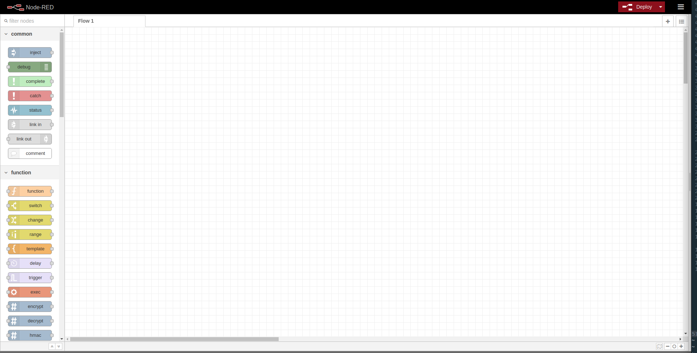
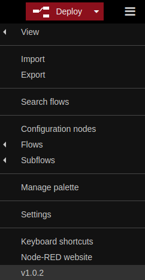
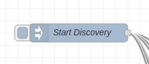

# Project 4

Body Area Network (BAN) demonstration using [Node-RED](https://nodered.org/).

## Prerequisite 

### Node

Node-RED requires node to be installed in the system. You can download and setup node from this - [Link](https://nodejs.org/en/)

### Node-RED

Assuming node is installed. 

Then we can install Node-RED by using the following command in shell/command line.

```
npm install -g node-red
```

### MQTT Server (Mosquitto)

Project uses MQTT channels to simulate wireless communication channel between them. We will be using **Mosquitto** which is an open source message broker that implements MQTT.

#### Linux (Debian)

To install Mosquitto in a debian machine copy paste the following instruction in terminal.

```
sudo apt-add-repository ppa:mosquitto-dev/mosquitto-ppa
sudo apt-get update
sudo apt-get install mosquitto
```

#### Windows

For windows we need to download the mosquitto executable installer from the following link - [https://mosquitto.org/download/](https://mosquitto.org/download/).

## Setup

### Starting NODE-RED

Open shell/command-prompt and the jump to the project directory run the below command to start Node-RED.

```
npx node-red
```

This will bring up the following window.



### Importing Flow

Next step for simulation is to import the discovery and communication flow into Node-Red.

To do so, we should first open the menu from the top left button and the click import. After that we select `discovery.json` and `communication.json` from the current directory.



## Running Simulation

### Discovery

Select the **Discovery** flow and click on **Deploy** button on the top. And to start the simulation click on the **Start Discovery** button as shown in the image below.



Discovery protocol will be running in the **Discovery Protocol** tab and communication protocol will be running in **Communication Protocol** tab.

## Implementation

To simulate discovery and communication the project uses MQTT channel to simulate wireless communication channel. Every node belong belong to one or more channel which simulate that the nodes can in communication range.

### Discovery Protocol

A sample of the code to simulate a discovery node is shown in the file [discovery_node_example.js](./discovery_node_example.js).

### Communication Protocol

Sample code of a node participating in communication is given in th file [communication_node_example.js](./communication_node_example.js)
